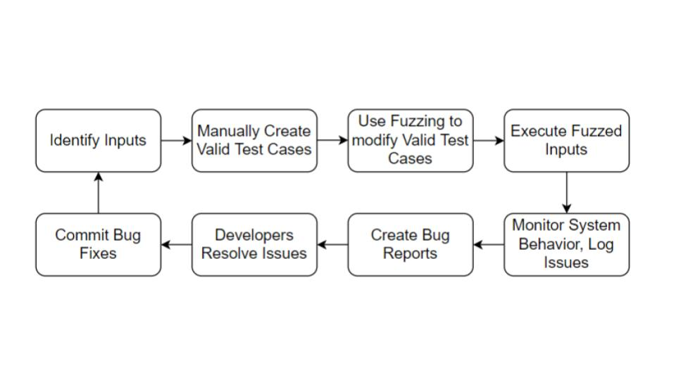

# ClusterFuzzLite Executable Tutorial - Brad Palagi, Ben Civjan

## Intending Learning Outcomes:
1. Backround on Fuzzing as a testing technique
2. Understanding the pros and cons of implementing Fuzzing versus standard unit testing
3. The ability to integrate Google's Atheris Open Source Python fuzzer with a Python project
4. How to add fuzzing to a CI workflow with Github actions

## Overview of what will be accomplished throughout this tutorial:

1. Integrating Google's Atheris with a Python project
2. Creating a GitHub repository to host project
3. Setting up Fuzzing CI pipeline through GitHub Actions on new repo

# Background:

"Fuzzing or fuzz testing is an automated software testing technique that involves providing invalid, unexpected, or random data as inputs to a computer program. The program is then monitored for exceptions such as crashes, failing built-in code assertions, or potential memory leaks."

The best fuzzers are ones that provide input that is on the boundary of validity. Rather than providing completely invalid inputs that would be immediately rejected by the program, a good fuzzer should provide *valid-enough* input so that a function will accept
it but produce wrong or unexpected results. This results in the best testing of edge cases and can stress-test the program very well
when used appropriately.

Fuzzing is an extremely useful technique when examining the security of a software program. One of the most useful areas of code to
fuzz is a 'trust boundary'. A trust boundary is a section of code where the input is from an untrusted user (i.e. A form input, http request, etc.) as opposed to a trusted user (eg. config file that can only be modified by an admin)

To improve the effectiveness of fuzzing beyond what can be acheived through pure random testing it is common to modify existing inputs rather than generate input from scratch.

Gray-box fuzzers use instrumentation to trace block transitions exercised by input which leads to a balance of performance as well as increased code coverage.

https://en.wikipedia.org/wiki/Fuzzing

# Value of Fuzz testing (in a CI Fasion)

Fuzz testing itself can be valuable in finding bugs which were missed by test cases created by a developer. It would be impossible to think of all edge cases on ones own. 

To identify a bug a fuzzer needs to be able to determine a faulty behaviour from a feature. A typical fuzzer will report inputs that lead to a crash, and there are other sanitizers which can detect memory related errors, race conditions, undefined behaviour, etc.

https://en.wikipedia.org/wiki/Fuzzing

Fuzzing is an efficient, cost-effective method of testing, it can provide thousands of tests in the time a few manual tests can be performed. The additional advantage is the automation possibilities fuzzing offers, many security professionals believe fuzzers should run continuously. Combining manual test cases with a fuzzer which can make modifications to inteligently created cases can result in a much more secure project.

Fuzzing has found many bugs in large projects, mainly looking for: 
- out of bounds
- out of range
- nil-pointer dereference
- faulty type assertion
- out of memory
- off-by-one
- infinite loop
- timeout
- divide by zero

https://developer.ibm.com/blogs/how-fuzzing-can-make-your-open-source-project-more-secure-and-reliable/ 

It is an essential security measure to constantly fuzz every code addition to a repository, thus using GitHub Actions is a great way to fuzz within a Continuous Integration workflow.

# Fuzzing Workflow

