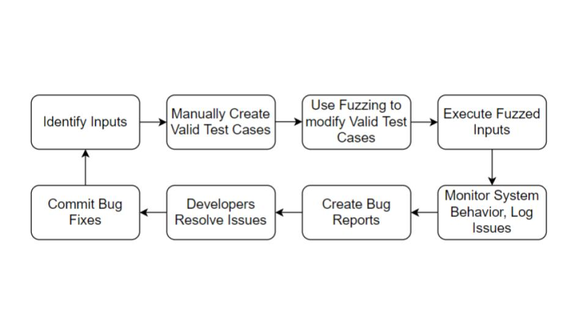

# Value of Fuzz testing (in a CI Fasion)

Fuzz testing itself can be valuable in finding bugs which were missed by test cases created by a developer. It would be impossible to think of all edge cases on ones own. 

To identify a bug a fuzzer needs to be able to determine a faulty behaviour from a feature. A typical fuzzer will report inputs that lead to a crash, and there are other sanitizers which can detect memory related errors, race conditions, undefined behaviour, etc.

Fuzzing is an efficient, cost-effective method of testing, it can provide thousands of tests in the time a few manual tests can be performed. The additional advantage is the automation possibilities fuzzing offers, many security professionals believe fuzzers should run continuously. Combining manual test cases with a fuzzer which can make modifications to inteligently created cases can result in a much more secure project.

Fuzzing has found many bugs in large projects, mainly looking for:2 
- out of bounds
- out of range
- nil-pointer dereference
- faulty type assertion
- out of memory
- off-by-one
- infinite loop
- timeout
- divide by zero

It is an essential security measure to constantly fuzz every code addition to a repository, thus using GitHub Actions is a great way to fuzz within a Continuous Integration workflow.
